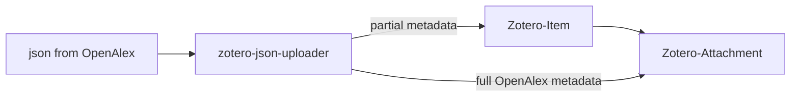

# Zotero-json-uploader

Convert json from openalex and scholarly to zotero json and upload to your zotero library

Also see https://github.com/OpenDevEd/openalex-cli/tree/main/jsontransform

## Installation

```bash
git clone https://github.com/OpenDevEd/zotero-json-uploader.git
cd zotero-json-uploader
npm run setup
```

## Configuration

The `zotero-json-uploader` command-line tool helps in setting up the Zotero configuration or database configuration. This section explains how to use the `config` command.

### Command Usage

#### Display Help Information

To display help information for the `config` command, use:

```bash
zotero-json-uploader config --help
```
### Options

- `-s, --set`: Specify the type of configuration to set up. This option is required and has the following choices:
    - `api-key`: Set up the Zotero API key configuration.
    - `database`: Set up the database configuration.
### Examples

#### Setup Zotero API Key Configuration

To set up the Zotero API key:

```bash
zotero-json-uploader config --set api-key
```

#### Setup Database Configuration

To set up the database configuration:

```bash
zotero-json-uploader config --set database
```

## Usage

### Getting help
```bash
zotero-json-uploader --help
```

### Uploading data to Zotero
```bash
zotero-json-upload -g "zotero://select/groups/your_group_id/collections/your_collection_key" -t transformation_method your_data.json
```

### Options
- -g, --group (required): The Zotero select link for the collection you want to upload to.
- -t, --transform: Choose the transformation method:
  - jq (requires -j): Apply a custom JQ filter defined in the file specified with -j.
  - openalexjq: Use the pre-defined JQ filter for OpenAlex data (located in the jq/openalex-to-zotero.jq file).
  - openalexjs: Use the JavaScript-based transformation for OpenAlex data (not yet implemented).
  - scholarlyjq: Use the pre-defined JQ filter for Scholarcy data (not yet implemented).
- -j, --jq: Path to your custom JQ file (required when using -t jq).

### Notes


### Uploading data to database

#### Display Help Information for db-upload

To display help information for the db-upload command, use:

```bash
zotero-json-uploader --help db-upload
```

#### Upload Data to the Database

To upload data to the database, use:

```bash
zotero-json-uploader db-upload [files...]
```

#### Options for db-upload

* -t, --transform: Choose the transformation to apply to the data. if not provided, the data will be uploaded depending on source in the meta.
  * Choices:
    - jq (requires -j): Apply a custom JQ filter defined in the file specified with -j.
    - openalexjq
    - openalexjs-sdgs
    - openalexjs
    - scholarlyjq
    - openalexjq-sdgs
    - scopusjq
* -j, --jq: Provide your own jq file. Required when using -t jq.

### Deduplicate the Database

Deduplicate the database based on specified criteria.

#### Command Usage

To deduplicate the database, use the following command:

```bash
zotero-json-uploader db-deduplicate [options...]
```

#### Options for db-deduplicate

* --export, -e: Export the deduplicated database table to CSV or JSON or RIS format. (string)
for example: "--export deduplicated.json"
* --rank, -r: Select records from the database by rank. (number)
* --compare, -c: Choose the comparison operator for ranking selection. (string)
  - Choices: "equals", "gt", "gte", "lt", "lte"
* -o, --output: Specify the output file name with .json or .csv extension. (string)
* -l, --limit: Limit the number of records to export. (number)
* --orderByRank: Order results by rank.
  - Choices: "asc", "desc"
* --relevance: Perform relevance ranking of the database. (boolean)
* -s, --rstring: Search the database for specified search terms. (string)
  - Must be a keywords for example: "climate | change" or "climate & change" or just "climate".
* -f, --rfields: Specify fields used for relevance ranking.
  - Choices: "title", "abstract", "keywords", "authors", "publication", "doi", "url", "date"
* -t, --rsort: Specify sort order for relevance ranking.
  - Choices: "asc", "desc"

### Dump the Database

#### Examples

Dump a Specific Table

```bash
zotero-json-uploader --table searchResults --output searchResults.json
```

#### Retrieve Unscreened Data from the Deduplicated table
  
```bash
zotero-json-uploader --table Deduplicated --output unscreened_Deduplicated.json --unscreened
```

#### Options for db-dump

* --table, -t: Specify the table to dump. (string)
* --output, -o: Specify the output file name with .json or .csv extension. (string)
* --unscreened, -u: Retrieve unscreened data from the deduplicated table. (boolean) (Works just with the Deduplicated table)
